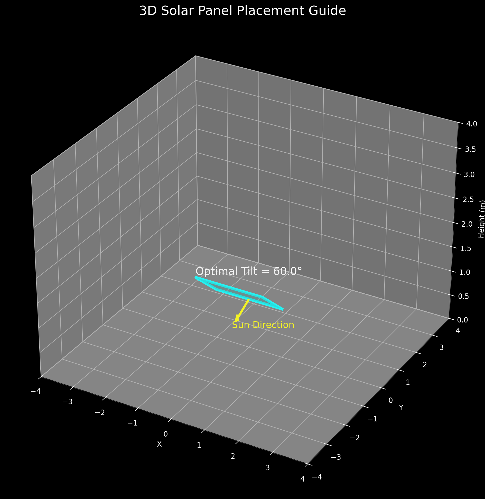

# ☀️ SolarSense: AI-Based Solar Panel Optimization System

> **An AI-powered web application that predicts the optimal solar panel tilt angle using Machine Learning to maximize energy generation and provides interactive visualizations for better decision-making.**


---

# 🌍 Project Overview

SolarSense is an intelligent Machine Learning-based web application designed to optimize solar panel efficiency by predicting the ideal tilt angle using environmental and geographical parameters.

The system combines **Artificial Intelligence**, **Data Analytics**, and **Interactive Visualization** to help users estimate power generation, improve panel orientation, and understand solar performance through intuitive graphs and 3D visualizations.

Whether you're a researcher, student, or renewable energy enthusiast, SolarSense provides an efficient and user-friendly platform for solar energy optimization.

---

# ✨ Key Features

- ☀️ Predicts the optimal solar panel tilt angle
- 🤖 Machine Learning model powered by XGBoost
- 📈 Dynamic power generation analysis
- 📊 Interactive Power vs Tilt visualization
- 🌍 3D solar panel placement visualization
- 📄 Automatic PDF report generation
- ⚡ Fast prediction engine
- 📱 Responsive web interface
- 📂 Modular and scalable project structure
- 🔬 Data preprocessing and feature engineering
- 🌱 Renewable energy optimization

---

# 📸 Project Preview
---

## Power vs Tilt Analysis


---

## 3D Solar Panel Visualization



---

## Solar Panel Placement


---

## Project Workflow


---

# 🛠 Tech Stack

| Technology | Purpose |
|------------|----------|
| Python | Backend Development |
| Flask | Web Framework |
| XGBoost | Machine Learning |
| Pandas | Data Processing |
| NumPy | Numerical Computing |
| Matplotlib | Data Visualization |
| HTML5 | Frontend |
| CSS3 | Styling |
| JavaScript | Client-side Interactivity |

---

# 📂 Project Structure

```text
SolarSense/
│
├── app.py
├── model.py
├── predict.py
├── visualization.py
├── requirements.txt
├── dashboard.png
├── graph.png
├── panel3d.png
├── placement3d.png
├── workflow.png
├── dataset/
├── static/
├── templates/
├── README.md
├── LICENSE
└── .gitignore
```

---

# ⚙️ Installation

Clone the repository

```bash
git clone https://github.com/yourusername/SolarSense.git
```

Navigate into the project

```bash
cd SolarSense
```

Install dependencies

```bash
pip install -r requirements.txt
```

Run the application

```bash
python app.py
```

Open your browser

```
http://127.0.0.1:5000
```

---

# 🚀 Project Workflow

```text
                User Input
                     │
                     ▼
        Environmental Parameters
                     │
                     ▼
          Data Preprocessing
                     │
                     ▼
        Feature Engineering
                     │
                     ▼
      XGBoost Machine Learning Model
                     │
                     ▼
       Optimal Tilt Angle Prediction
                     │
                     ▼
     Solar Power Generation Estimation
                     │
                     ▼
     Graphs • 3D Visualization • Reports
```

---

# 🧠 Machine Learning Pipeline

### Input Parameters

- Latitude
- Longitude
- Solar Irradiance
- Ambient Temperature
- Panel Efficiency
- Weather Conditions

### Output

- Optimal Tilt Angle
- Estimated Solar Power
- Efficiency Analysis

---

# 📊 Sample Prediction

| Parameter | Value |
|-----------|-------|
| Latitude | 15.84° |
| Longitude | 74.50° |
| Solar Irradiance | 920 W/m² |
| Temperature | 31°C |
| Predicted Tilt Angle | 48° |
| Estimated Efficiency | 93.4% |

---

# 📐 Mathematical Model

The generated power is estimated using the equation:

```text
P = A × G × η × cos(θ)
```

Where:

| Symbol | Description |
|--------|-------------|
| **P** | Power Output |
| **A** | Panel Area |
| **G** | Solar Irradiance |
| **η** | Panel Efficiency |
| **θ** | Tilt Angle |

---

# 📈 Advantages

- Improves solar panel efficiency
- Reduces energy losses
- Accurate ML-based predictions
- Easy-to-use web interface
- Interactive visualizations
- Supports renewable energy planning
- Scalable architecture
- Fast prediction time

---

# 🔮 Future Enhancements

- 🌤 Live Weather API Integration
- 🛰 Google Maps Location Selection
- 📡 IoT Sensor Integration
- 📱 Mobile Application
- 📊 Plotly Interactive Graphs
- ☁ Cloud Deployment
- 🌙 Dark Mode
- 📂 Prediction History
- 🔔 Smart Notifications
- 🤖 Real-Time Solar Tracking

---

# 📦 Requirements

```
Python 3.11+

Flask

Pandas

NumPy

Matplotlib

XGBoost

Scikit-learn

Joblib
```

Install all dependencies

```bash
pip install -r requirements.txt
```

---

# 🤝 Contributing

Contributions are welcome!

1. Fork this repository

2. Create a feature branch

```bash
git checkout -b feature-name
```

3. Commit your changes

```bash
git commit -m "Added new feature"
```

4. Push to GitHub

```bash
git push origin feature-name
```

5. Create a Pull Request

---

# 📄 License

This project is licensed under the **MIT License**.

---

# 👩‍💻 Author

**Ramya Kulkarni**

Computer Science Engineering Student

Artificial Intelligence • Machine Learning • Renewable Energy • Data Science

---

# ⭐ Support the Project

If you found this project useful, consider giving it a ⭐ on GitHub.

Your support motivates further development and improvements!

---
